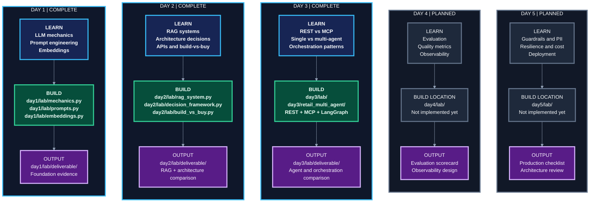
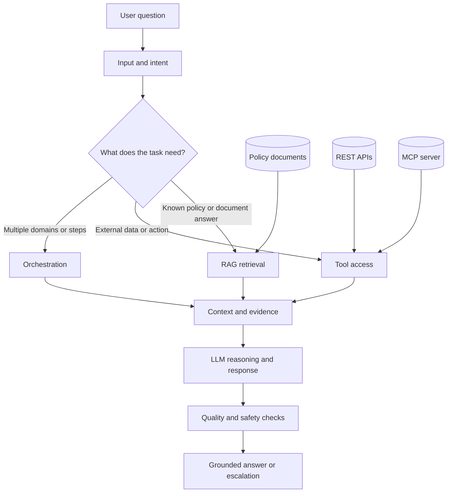

# Applied Agentic AI - Day-by-Day Labs

Hands-on lab companion to the Walmart Applied Agentic AI course in
`Walmart-USA-21-22-23-28-29-September-2026`.

This repository turns the course notebooks into small, runnable, reviewable
engineering labs. The progression is intentional: understand the model first,
add retrieval and architecture decisions next, then introduce tools, agents, and
orchestration.

> **Learning principle:** do not add an agent, framework, vector store, or
> protocol until the problem justifies it.

Shared plumbing lives in `common/`; each day folder contains only that day's
teaching material, labs, and deliverables.

## What this project demonstrates

- LLM mechanics: tokens, cost, context windows, memory, and temperature.
- Prompt engineering: zero-shot, few-shot, reasoning, roles, and structured output.
- Embeddings and semantic similarity as the foundation for retrieval.
- Source-grounded RAG with LangChain and FAISS.
- A five-axis framework for choosing traditional software, workflows, agents, or hybrid designs.
- REST versus MCP, including a real FastMCP server and tool discovery.
- Single-agent, coordinator/specialist, sequential, router, and supervisor designs.
- Trade-offs involving quality, latency, cost, reliability, governance, and maintainability.

## Learning Graph

The **BUILD** cards show exactly where implementation exists in the repository.
The **OUTPUT** cards show the reviewable artifact. Green is built today; gray is
planned work that has not been implemented yet.



### Diagram legend

| Visual | Meaning |
| --- | --- |
| Dark blue | Completed learning |
| Dark green | Existing implementation and repository path |
| Dark slate | Planned work or future implementation location |
| Purple | Deliverable or review artifact |

## Repository map

```text
common/config.py             Shared environment and model settings

day1/topics/                 Concepts and comparison tables
day1/lab/                    Mechanics, prompts, embeddings, deliverable

day2/topics/                 RAG, architecture scoring, API concepts
day2/lab/                    RAG, decision framework, build-vs-buy, docs

day3/topics/                 REST/MCP, agents, orchestration concepts
day3/lab/                    Tools, agents, MCP server, orchestration
 day3/retail_multi_agent/     Product, inventory, order, policy specialists

day4/                         Planned evaluation and observability
day5/                         Planned production readiness
activate                      Virtualenv activation and aliases
requirements.txt              Python dependencies
```

## Quick start

Requirements: Python 3.10, 3.11, or 3.12; an OpenAI key; and optional
OpenWeatherMap and Tavily keys for live API labs.

### macOS/Linux

```bash
git clone https://github.com/rakeshmatha/advanced-agentic-ai.git
cd advanced-agentic-ai
python3 -m venv .venv
source .venv/bin/activate
python -m pip install --upgrade pip
pip install -r requirements.txt
```

### Windows PowerShell

```powershell
git clone https://github.com/rakeshmatha/advanced-agentic-ai.git
cd advanced-agentic-ai
py -3 -m venv .venv
.\.venv\Scripts\Activate.ps1
python -m pip install --upgrade pip
pip install -r requirements.txt
```

Create `.env` in the repository root and never commit it:

```dotenv
OPENAI_API_KEY=your-openai-key
OPENWEATHERMAP_API_KEY=your-openweathermap-key
TAVILY_API_KEY=your-tavily-key
```

On macOS/Linux, `source ./activate` activates `.venv` and loads all aliases.

## Run the labs

```bash
# Day 1 - model and prompt foundations
mechanics
mechanics --chat
mechanics "SKU-123"
prompts
prompts --chat
embeddings
embeddings --chat

# Day 2 - retrieval and architecture decisions
rag
rag "Can I return an unopened item?"
architecture-decision
architecture-decision --demo
build-vs-buy

# Day 3 - tools, agents, and orchestration
restmcp
singlemulti
assistant
compare
retail_multi_agent
```

Focused Day 3 examples:

```bash
assistant "Where is my order WM-2024-002?"
sequential "What is the price of milk and is it in stock?"
router "Check my order WM-2024-002."
supervisor "Do you price match? I saw eggs cheaper at Target."
compare --pattern router
retail_multi_agent router "How much is milk?"
retail_multi_agent supervisor "Price milk, check stock, and explain the return policy."
python -m day3.lab.mcp_server
```

Every alias maps to a module such as `python -m day3.lab.compare`, so commands
can also be run without aliases.

## Architecture overview



This is a teaching architecture, not a requirement that every application use
every component. The Day 2 decision framework helps avoid unnecessary agentic
complexity.

## Key design decisions

### RAG versus model memory

Use RAG when answers must be grounded in changing or private documents. The Day
2 lab chunks documents, embeds them, searches FAISS, and answers from retrieved
context with sources. Questions outside the knowledge base should be refused.

### Architecture selection

The IN01 framework scores five axes from 1 to 5. Python rules, not the LLM,
make the final choice.

| Axis | Low score | High score |
| --- | --- | --- |
| Task complexity | Single step | Multi-step and dynamic |
| Latency tolerance | Real-time | Batch acceptable |
| Cost ceiling | Pennies/query | Dollars/query |
| Risk tolerance | Very low | Errors caught downstream |
| Update frequency | Rarely changes | Changes frequently |

Score bands: **5-12 traditional**, **13-18 workflow**, **19-25 agent**. A hybrid
override applies to high-complexity tasks with tight latency or cost constraints.

### REST versus MCP

- Use REST when one application owns a small number of tools.
- Use MCP when multiple agents or hosts need to discover and share tool definitions.
- Protocol choice is separate from the decision to use an agent.

### Orchestration patterns

| Pattern | Control flow | Best fit | Main trade-off |
| --- | --- | --- | --- |
| Sequential | classify -> tools -> quality -> format | Fixed, auditable steps | More calls and fixed latency |
| Router | classify -> one specialist | Clear, separate intents | Mis-routing risk |
| Supervisor | supervisor <-> workers until finish | Multi-domain tasks and retries | Higher latency and complexity |

## Day-by-day guide

| Day | Status | Main topics | Reviewable output |
| --- | --- | --- | --- |
| [Day 1](day1/README.md) | Complete | LLM mechanics, prompts, embeddings | Foundation reflection and evidence |
| [Day 2](day2/README.md) | Complete | RAG, architecture scoring, APIs | Architecture comparison |
| [Day 3](day3/README.md) | Complete | REST/MCP, agents, orchestration | Agent and orchestration comparison |
| Day 4 | Planned | Evaluation and observability | Evaluation scorecard |
| Day 5 | Planned | Production readiness and architecture review | Production checklist and ARB package |

See each day's `topics/` for concepts and `lab/deliverable/` for reviewable
artifacts.

## Troubleshooting

- **`OPENAI_API_KEY is missing`:** create `.env` in the repository root and reload the shell.
- **`No .venv found`:** run `python3 -m venv .venv`, then activate it.
- **Live API failure:** check the relevant optional key, service availability, and quota.
- **MCP import errors:** keep `mcp` on the 1.x line as pinned in `requirements.txt`.
- **GitHub authentication:** use `gh auth login`, a personal access token for HTTPS, or SSH:

```bash
git remote set-url origin git@github.com:rakeshmatha/advanced-agentic-ai.git
```

## Security and responsible use

- Keep `.env` and API keys out of Git history, logs, screenshots, and notebooks.
- Treat model output as untrusted data and validate structured output.
- Do not use classroom tools for real customer actions without authorization,
  audit logging, access controls, retries, timeouts, and human escalation.
- Do not send confidential or regulated data to external APIs without approval.

## Completion criteria

The complete learning path should produce an assistant that can answer supported
policy questions with evidence, refuse or escalate unsupported questions, choose
an architecture using explicit trade-offs, use external tools, compare
orchestration patterns with quality/latency/cost evidence, pass a golden test
set, report operational metrics, and explain its production controls.

## License and course context

This is a course companion and learning project. Add an explicit license before
reusing the code elsewhere, and follow the policies of the course, organization,
and external API providers.
