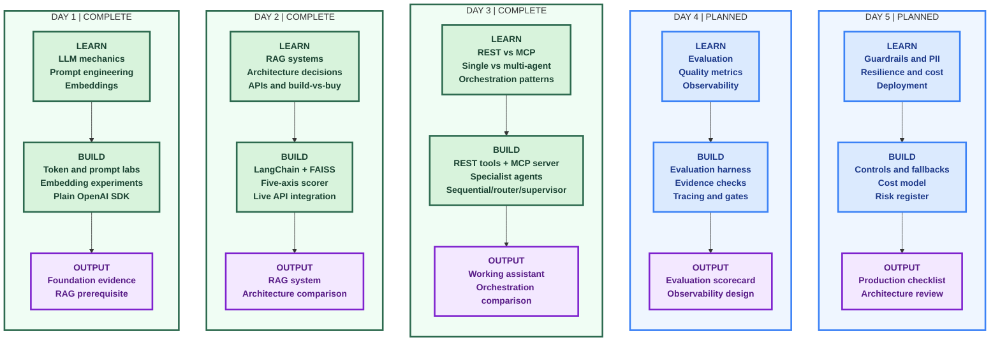
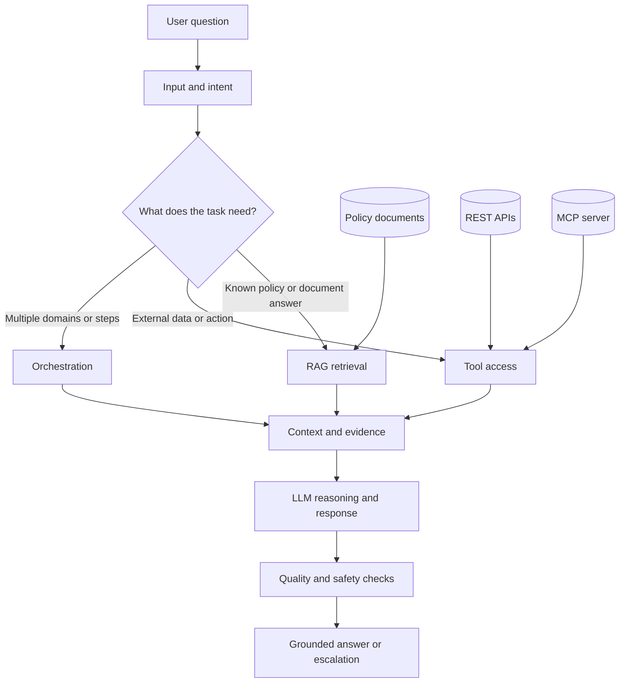

# Applied Agentic AI - Day-by-Day Labs

Hands-on lab companion to the Walmart Applied Agentic AI course in
`Walmart-USA-21-22-23-28-29-September-2026`.

This repository turns the course notebooks into small, runnable, reviewable
engineering labs. The progression is intentional: understand the model first,
add retrieval and architecture decisions next, then introduce tools, agents, and
orchestration.

> **Learning principle:** do not add an agent, framework, vector store, or
> protocol until the problem justifies it.

Every day folder contains only what that day's class taught. Shared plumbing
lives in `common/`, while each day remains independently understandable and
reviewable.

## What this project demonstrates

- LLM mechanics: tokens, cost, context windows, memory, and temperature.
- Prompt engineering: zero-shot, few-shot, reasoning prompts, role prompting,
  and structured output.
- Embeddings and semantic similarity as the foundation for retrieval.
- A source-grounded RAG system using LangChain and FAISS.
- A five-axis architecture decision framework for choosing traditional software,
  workflows, agents, or a hybrid.
- REST versus MCP, including a real FastMCP server and client-side tool
  discovery.
- Single-agent, coordinator/specialist, sequential, router, and supervisor
  designs.
- Trade-offs involving quality, latency, cost, reliability, maintainability,
  governance, and operational complexity.

## Learning Graph



### Diagram legend

| Visual | Meaning |
| --- | --- |
| Green | Completed learning and implementation |
| Blue | Planned learning and implementation |
| Purple | Day deliverable or review artifact |

## Repository map

```text
common/
  config.py                 Shared environment and model settings

day1/
  topics/                   Concepts, explanations, and comparison tables
  lab/                      Runnable mechanics, prompt, and embedding labs
  lab/deliverable/          Reflection and evidence

day2/
  topics/                   RAG, architecture scoring, and API concepts
  lab/                      RAG, decision framework, and build-vs-buy labs
  lab/docs/                 Knowledge base used by the RAG lab
  lab/deliverable/          Architecture comparison and evidence

day3/
  topics/                   REST/MCP, agents, and orchestration concepts
  lab/                      Tools, agents, MCP server, and orchestration labs
  retail_multi_agent/       Product, inventory, order, and policy specialists
  lab/deliverable/          Architecture and pattern comparison

day4/                       Planned evaluation and observability work
day5/                       Planned production-readiness work
activate                    Virtualenv activation and command aliases
requirements.txt            Python dependencies
```

## Quick start

### 1. Requirements

- Python 3.10, 3.11, or 3.12.
- An OpenAI API key for model-backed labs.
- Optional OpenWeatherMap and Tavily keys for the live-API labs.
- Internet access for API-backed examples.

### 2. Create the environment

macOS/Linux:

```bash
git clone https://github.com/rakeshmatha/advanced-agentic-ai.git
cd advanced-agentic-ai
python3 -m venv .venv
source .venv/bin/activate
python -m pip install --upgrade pip
pip install -r requirements.txt
```

Windows PowerShell:

```powershell
git clone https://github.com/rakeshmatha/advanced-agentic-ai.git
cd advanced-agentic-ai
py -3 -m venv .venv
.\.venv\Scripts\Activate.ps1
python -m pip install --upgrade pip
pip install -r requirements.txt
```

After the first setup, from macOS/Linux you can use `source ./activate`. This
activates `.venv` and loads the short lab commands. PowerShell uses
`. .\Activate.ps1` when that helper is available in the local checkout.

### 3. Configure environment variables

Create `.env` in the repository root. Never commit this file or paste keys into
source code.

```dotenv
OPENAI_API_KEY=your-openai-key
OPENWEATHERMAP_API_KEY=your-openweathermap-key
TAVILY_API_KEY=your-tavily-key
```

`OPENAI_API_KEY` is required for most labs. The weather and demand keys are only
needed by the live API examples. Tokenization and some Day 1 demonstrations can
run without an API key.

## Run the labs

Activate the environment first:

```bash
source ./activate
```

### Day 1 - model and prompt foundations

```bash
mechanics                         # tokens, cost, context, memory, temperature
mechanics --chat                  # interactive mechanics demonstration
mechanics "SKU-123"               # one-shot token and cost inspection
prompts                           # zero-shot, few-shot, reasoning, role, schema
prompts --chat                    # try prompt patterns with your own text
embeddings                        # text-to-vector demonstration
embeddings --chat                 # compare semantic similarity interactively
```

### Day 2 - retrieval and architecture decisions

```bash
rag                               # interactive RAG chat over day2/lab/docs/
rag "Can I return an unopened item?"  # one-shot grounded question
architecture-decision             # score a use case interactively
architecture-decision --demo      # run class examples
build-vs-buy                     # live stock recommendation and trade-offs
```

### Day 3 - tools, agents, and orchestration

```bash
restmcp                           # REST vs MCP and framework comparison
singlemulti                       # single-agent vs coordinator/specialists
assistant                         # interactive Walmart assistant
compare                           # sequential vs router vs supervisor
retail_multi_agent                # multi-domain retail assistant
```

Focused examples:

```bash
assistant "Where is my order WM-2024-002?"
sequential "What is the price of milk and is it in stock?"
router "Check my order WM-2024-002."
supervisor "Do you price match? I saw eggs cheaper at Target."
compare --pattern router
retail_multi_agent router "How much is milk?"
retail_multi_agent supervisor "Price milk, check stock, and explain the return policy."
python -m day3.lab.mcp_server
```

Every alias maps to a module such as `python -m day3.lab.compare`, so the labs
can also be run without aliases.

## Architecture overview

The labs evolve from a simple model call into a grounded, tool-using assistant:



This is a teaching architecture, not a claim that every production assistant
needs all of these components. The Day 2 decision framework is deliberately used
to avoid unnecessary agentic complexity.

## Key design decisions

### RAG versus model memory

Use RAG when answers must be grounded in changing or private documents. The Day 2
RAG lab loads documents, splits them into chunks, embeds them, searches FAISS,
and asks the model to answer from the retrieved context with source references.
Questions outside the knowledge base should be refused rather than guessed.

### Choosing an architecture

The IN01 framework scores five axes from 1 to 5:

| Axis | Low score | High score |
| --- | --- | --- |
| Task complexity | Single step | Multi-step and dynamic |
| Latency tolerance | Real-time | Batch is acceptable |
| Cost ceiling | Pennies per query | Dollars per query |
| Risk tolerance | Very low | Errors can be caught downstream |
| Update frequency | Rarely changes | Changes frequently |

The score bands are **5-12 traditional**, **13-18 workflow**, and **19-25
agent**, with a hybrid override for high-complexity tasks that also have tight
latency or cost constraints. Python rules—not the LLM—make the final choice.

### REST versus MCP

- Use REST when one application owns a small number of tools and explicit API
  contracts are sufficient.
- Use MCP when multiple agents or hosts need to discover and share the same tool
  definitions without copying schemas into every client.
- Protocol choice is separate from the decision to use an agent.

### Orchestration patterns

| Pattern | Control flow | Best fit | Main trade-off |
| --- | --- | --- | --- |
| Sequential | classify -> tools -> quality -> format | Fixed, auditable steps | More calls and fixed latency |
| Router | classify -> one specialist | Clear, mostly separate intents | Mis-routing risk |
| Supervisor | supervisor <-> workers until finish | Multi-domain tasks and retries | Higher latency and complexity |

## Day-by-day guide

| Day | Status | Main topics | Reviewable output |
| --- | --- | --- | --- |
| [Day 1](day1/README.md) | Complete | LLM mechanics, prompts, embeddings | Foundation reflection and evidence |
| [Day 2](day2/README.md) | Complete | RAG, architecture scoring, APIs | Architecture comparison |
| [Day 3](day3/README.md) | Complete | REST/MCP, agents, orchestration | Agent and orchestration comparison |
| Day 4 | Planned | Evaluation and observability | Evaluation scorecard |
| Day 5 | Planned | Production readiness and architecture review | Production checklist and ARB package |

Each day's `topics/` explains the concepts and each `lab/deliverable/` contains
the artifact that can be reviewed independently.

## Troubleshooting

### `OPENAI_API_KEY is missing`

Create `.env` in the repository root, confirm the variable name is exactly
`OPENAI_API_KEY`, and run the command from the repository root. Then reload the
shell or run `source ./activate` again.

### `No .venv found`

Create the environment first:

```bash
python3 -m venv .venv
source .venv/bin/activate
```

### A live API lab fails

Check that the relevant optional key is present, the service is reachable, and
that the key has not expired or exceeded its quota. The RAG and most local
teaching examples do not require both live API keys.

### MCP import or API errors

Day 3 uses the FastMCP API from the `mcp` 1.x line. Install from the pinned
`requirements.txt` rather than upgrading `mcp` independently to an incompatible
major version.

### GitHub authentication fails

GitHub does not accept account passwords for Git over HTTPS. Use `gh auth login`,
a personal access token as the HTTPS password, or an SSH remote:

```bash
git remote set-url origin git@github.com:rakeshmatha/advanced-agentic-ai.git
```

## Security and responsible use

- Keep `.env` and API keys out of Git history, logs, screenshots, and notebooks.
- Treat model output as untrusted data; validate structured output before using it.
- Do not use these classroom tools for real customer actions without authorization,
  audit logging, access controls, retries, timeouts, and human escalation.
- Avoid sending confidential, personal, or regulated data to external model or
  search APIs unless the applicable policy explicitly permits it.
- Day 4 and Day 5 are planned specifically to address evaluation, observability,
  guardrails, resilience, cost, and production readiness.

## Completion criteria

The complete learning path should produce an assistant that can:

1. Answer supported policy questions using retrieved evidence.
2. Refuse or escalate unsupported questions instead of inventing answers.
3. Select an appropriate architecture based on explicit trade-offs.
4. Use external tools through suitable interfaces.
5. Compare orchestration patterns using quality, latency, and cost evidence.
6. Pass a golden test set and report operational metrics.
7. Explain its production controls and architecture choices in a reviewable note.

## License and course context

This repository is a course companion and learning project. Add an explicit
license before reusing the code in another project, and follow the policies of
the course, your organization, and each external API provider.
