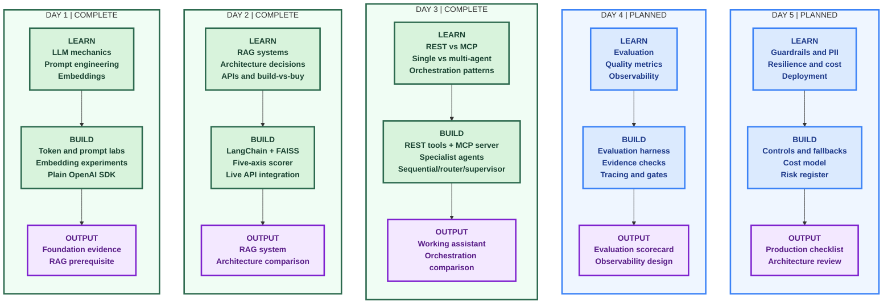

# Applied Agentic AI - Day-by-Day Labs

Hands-on lab companion to the Walmart Applied Agentic AI course in
`Walmart-USA-21-22-23-28-29-September-2026`. **Each day folder contains only what
that day's class taught** - nothing pulled forward, nothing left behind. Every
day is self-contained and builds on the previous one.

Shared plumbing (env loading, OpenAI client) lives in `common/` so no day imports
another day.

## Layout

```text
common/     Shared config + OpenAI client (not a class day)
day1/       LLM mechanics, prompt engineering, embeddings (RAG prerequisite)
day2/       RAG system (LangChain + FAISS), architecture scorer, build-vs-buy intro
day3/       REST vs MCP (+ real MCP server), single/multi-agent, orchestration
day4/       Planned: evaluation and observability
day5/       Planned: production readiness and architecture review
```

## Learning Graph



### Diagram Legend

| Visual | Meaning |
| --- | --- |
| Green | Completed learning and implementation |
| Blue | Planned learning and implementation |
| Purple | Day deliverable or review artifact |

## Setup

```bash
cd advanced-agentic-ai
python3 -m venv .venv
source ./activate                 # activates .venv and loads short commands
pip install -r requirements.txt   # first time only
```

`source ./activate` needs `.env` with `OPENAI_API_KEY` (and
`OPENWEATHERMAP_API_KEY`, `TAVILY_API_KEY` for the live-API labs). PowerShell:
`. .\Activate.ps1`.

## Run each day

```bash
# Day 1 - foundations (plain OpenAI SDK)
mechanics        # tokenization, cost, context window, temperature
prompts          # zero-shot, few-shot, CoT, role, structured output
embeddings       # text -> vectors

# Day 2 - RAG + decisions
rag                                    # interactive RAG chat over docs/
rag "Can I return an unopened item?"   # one-shot
architecture-decision                  # describe a use case; IN01 picks architecture
build-vs-buy                           # live stock rec + REST/MCP/framework/build-vs-buy

# Day 3 - protocols, agents, orchestration
restmcp          # REST vs MCP + Python/LangChain/LangGraph bake-off
singlemulti      # single-agent vs coordinator + specialists
assistant        # interactive Walmart assistant (chat)
compare          # sequential vs router vs supervisor
```

Each command maps to `python -m dayN.lab.<module>`; the aliases load with
`source ./activate`.

## Progress

| Day | Status | Class notebooks covered |
| --- | --- | --- |
| Day 1 | Complete | LLM mechanics + prompts; RAG prerequisites (embeddings) |
| Day 2 | Complete | RAG system (LangChain+FAISS); IN01 architecture; IN03 build-vs-buy intro |
| Day 3 | Complete | IN03 REST vs MCP; IN04 single/multi-agent; IN05 orchestration |
| Day 4 | Planned | Evaluation and observability |
| Day 5 | Planned | Production readiness and architecture review |

Each day's `topics/` explains what was taught; each `lab/deliverable/` holds the
reviewable artifact for that day.
