# Customer Service RAG

Python-only learning project using LangChain for RAG components and LangGraph
for workflow orchestration.

The learning work is organized by day under `day1/` through `day5/`. Day 1 is
complete; Day 2 is the current implementation phase.

## Layout

```text
day1/topics/            Combined Day 1 learning topics
day1/lab/               Day 1 runnable implementation and documents
day1/lab/deliverable/   Day 1 final decision matrix and output
day2/                   Day 2 agent architecture workspace
day3/                   Day 3 advanced orchestration workspace
day4/                   Day 4 evaluation and observability workspace
day5/                   Day 5 production readiness workspace
```

## Run

```powershell
.\venv\Scripts\Activate.ps1
python -m day1.lab.ask "Can I return an unopened item?"
```

Add `.md` or `.txt` files to `day1/lab/documents/` as the policy knowledge base grows.
See [day1/lab/deliverable/decision-matrix.md](day1/lab/deliverable/decision-matrix.md)
for the completed Day 1 design decision.

## Learning Plan

This project follows a foundation-to-production path for a customer-service AI
assistant. Each phase adds a capability and a reviewable engineering artifact.

## Learning Graph

```mermaid
flowchart TB
    D1["Day 1 | COMPLETE"] --> D2["Day 2 | CURRENT"]
    D2 --> D3["Day 3 | PLANNED"]
    D3 --> D4["Day 4 | PLANNED"]
    D4 --> D5["Day 5 | PLANNED"]

    subgraph S1["Day 1: Foundation and Engineering Decisions"]
        D1T["LEARNED\n- Agent vs workflow vs traditional software\n- RAG vs fine-tuning vs prompting\n- REST API vs MCP\n- Cost, latency, quality, maintainability"]
        D1L["DEVELOPED LOCALLY\n- day1/lab/application/rag.py\n- LangChain chunking and OpenAI embeddings\n- Chroma persistent retrieval\n- LangGraph retrieve -> answer flow\n- Policy-grounded answers with sources"]
        D1O["DAY 1 DELIVERABLE\n- day1/lab/deliverable/decision-matrix.md\n- Customer-service policy corpus\n- Two-use-case technology analysis"]
        D1T --> D1L --> D1O
    end

    subgraph S2["Day 2: Agent Architecture"]
        D2T["LEARNING NOW\n- Single-agent vs multi-agent\n- Sequential and router patterns\n- Tool boundaries and escalation\n- Handoffs and failure behavior"]
        D2L["DEVELOPING LOCALLY\n- day2/lab/router.py\n- classify_request node\n- Policy route to Day 1 RAG\n- Human escalation route\n- Typed LangGraph state and updates"]
        D2O["DAY 2 DELIVERABLE\n- day2/lab/deliverable/architecture-comparison.md\n- Sequential vs router comparison\n- Route and failure analysis"]
        D2T --> D2L --> D2O
    end

    subgraph S3["Day 3: Advanced Orchestration"]
        D3T["TO LEARN\n- Planner-executor\n- Supervisor or hierarchical flow\n- Tools, REST, MCP\n- Handoffs, timeouts, retries, context loss"]
        D3L["TO DEVELOP LOCALLY\n- Shared customer-service tools\n- Planner workflow\n- Supervisor workflow\n- Same inputs across patterns\n- Failure and latency comparison"]
        D3O["DAY 3 DELIVERABLE\n- Architecture comparison report\n- Quality, cost, latency, failure modes"]
        D3T --> D3L --> D3O
    end

    subgraph S4["Day 4: Evaluation and Observability"]
        D4T["TO LEARN\n- Golden datasets and regression\n- Retrieval, answer, and task metrics\n- LLM-as-judge\n- Logs, traces, drift, release gates"]
        D4L["TO DEVELOP LOCALLY\n- Golden question harness\n- Evidence and route checks\n- Timing and token measurements\n- Retrieval and graph traces\n- Scorecard prototype"]
        D4O["DAY 4 DELIVERABLE\n- Evaluation scorecard\n- Pass/fail thresholds\n- Observability dashboard design"]
        D4T --> D4L --> D4O
    end

    subgraph S5["Day 5: Production Readiness and Architecture Review"]
        D5T["TO LEARN\n- Guardrails and prompt-injection defense\n- PII and access control\n- Resilience and fallbacks\n- Token economics and model routing\n- Deployment and incident response"]
        D5L["TO DEVELOP LOCALLY\n- Input and output controls\n- Retry, timeout, fallback tests\n- Cost model and context controls\n- Risk register and rollback plan\n- Review-board checklist"]
        D5O["DAY 5 DELIVERABLE\n- Production-readiness checklist\n- Cost and risk package\n- Architecture Review Board presentation"]
        D5T --> D5L --> D5O
    end

    classDef complete fill:#d8f3dc,stroke:#2d6a4f,color:#1b4332
    classDef current fill:#fff3bf,stroke:#e09f3e,color:#7f4f24
    classDef planned fill:#dbeafe,stroke:#3b82f6,color:#1e3a8a
    classDef deliverable fill:#f3e8ff,stroke:#7e22ce,color:#581c87
    class D1,D1T,D1L complete
    class D1O deliverable
    class D2,D2T,D2L current
    class D2O deliverable
    class D3,D3T,D3L,D4,D4T,D4L,D5,D5T,D5L planned
    class D3O,D4O,D5O deliverable
```



### Day 1: Foundation and Engineering Decisions - Complete

- Refresh Python environments, model calls, prompts, context windows, and RAG.
- Build the first policy-grounded customer-service question-answering flow.
- Compare traditional software, workflows, and agents.
- Compare RAG, fine-tuning, and prompting using cost, latency, quality, and maintainability.
- Compare REST APIs and MCP for external capabilities.
- Analyze two business use cases and create the initial decision matrix.

Artifacts: [day1/](day1/), [decision matrix](day1/lab/deliverable/decision-matrix.md),
and the sequential workflow in `day1/lab/application/workflow.py`.

### Day 2: Agent Architecture - In Progress

- Compare workflows, single-agent systems, and multi-agent systems.
- Add sequential and router patterns for customer-service questions.
- Define tool boundaries, escalation behavior, and failure handling.
- Explain why added orchestration complexity is justified.

Artifacts: [day2/topics/](day2/topics/), [day2/lab/](day2/lab/), and
[day2/lab/deliverable/](day2/lab/deliverable/).

### Day 3: Advanced Orchestration - Planned

- Explore planner-executor and supervisor patterns.
- Compare built-in functions, custom tools, REST APIs, and MCP integration.
- Model timeouts, retries, hallucinations, context loss, and handoff failures.

Deliverable: compare multiple orchestration strategies using the same tools.

### Day 4: Evaluation and Observability - Planned

- Create a golden question set for retrieval and answer quality.
- Measure evidence hit rate, answer quality, task success, latency, and cost.
- Add structured logs and traces for retrieval, model calls, and tool use.
- Define regression thresholds and a go/no-go scorecard.

Deliverable: evaluation harness and observability design.

### Day 5: Production Readiness and Architecture Review - Planned

- Add input validation, prompt-injection defenses, PII handling, retries,
  timeouts, fallbacks, and access controls.
- Optimize tokens, context size, caching, model selection, and operating cost.
- Document deployment, rollback, incident response, risks, and mitigations.
- Defend architecture choices using evidence rather than preference.

Deliverable: production-readiness checklist and architecture review package.

### Completion Criteria

The system is ready for the next phase when it can answer supported policy
questions with evidence, escalate unsupported questions, pass a golden test set,
report latency and cost, and explain its technology choices in a trade-off note.